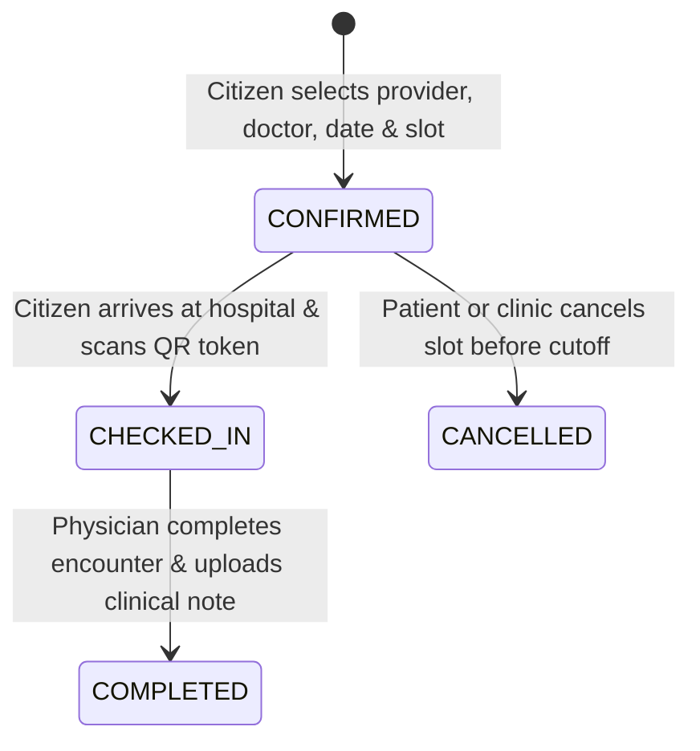

# AHCS — Appointments Engine & Slot Management

## 1. Core Principles
- **Zero Double-Booking Guarantee**: The AHCS appointment engine strictly guarantees that no physician can be booked for multiple consultations at the same date and time slot.
- **Atomic Concurrency Control**: Slot conflict validation (`checkSlotConflict(providerId, doctorId, appointmentDate, timeSlot)`) is executed before any appointment creation. If a slot is already taken by a confirmed booking, the server immediately returns HTTP 409 Conflict.
- **Client ID Grounding**: Every appointment is linked to the authenticated patient's Client ID and Account ID.

## 2. Appointment Booking Lifecycle

## 3. Real-Time Notifications & Audit Trails
- Upon booking confirmation, an automated in-app notification is dispatched to the patient (`APPOINTMENT` category).
- Every booking, status transition, and cancellation is immutably recorded in `auditLogs` with actor identity, IP address, and timestamp.

## 4. API Specification
- `GET /api/v1/appointments`: Lists all upcoming and past appointments for the authenticated citizen or provider doctor.
- `POST /api/v1/appointments`: Confirms a new appointment slot with double-booking prevention.
- `PATCH /api/v1/appointments/status`: Transitions appointment states (`CONFIRMED` -> `CHECKED_IN` -> `COMPLETED` / `CANCELLED`).
