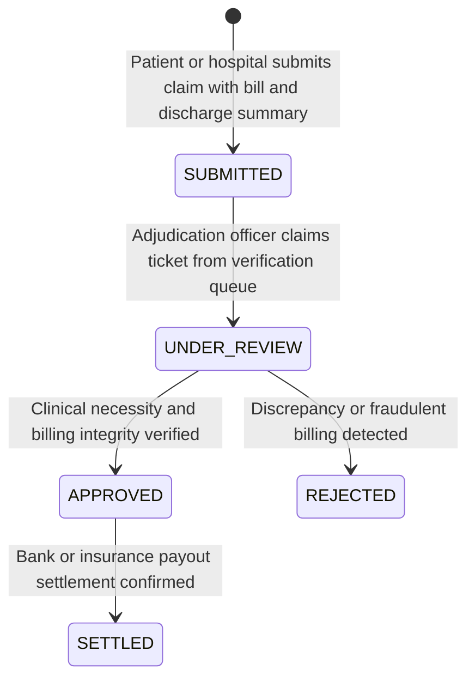

# AHCS — Claims Adjudication & Settlement Workflow

## 1. Overview
The AHCS Claims Workflow enables citizens and healthcare providers to submit medical reimbursement and cashless claims with strict anti-fraud safeguards.

## 2. Fraud & Duplicate Protection
- **Invoice Fingerprinting**: Submissions are checked for identical `(providerId, invoiceNumber)`. Duplicate attempts are rejected with HTTP 409 Conflict.
- **Velocity Thresholds**: Multiple rapid claims submitted within a short window trigger immediate fraud alerts in `fraudAlerts`.

## 3. Claim Lifecycle

## 4. API Endpoints
- `GET /api/v1/claims`: Lists all claims for citizen or verification officer.
- `POST /api/v1/claims`: Creates a new claim with duplicate invoice prevention.
- `POST /api/v1/claims/adjudicate`: Allows verification officers to approve, reject, or mark claims settled with mandatory rationale logging.
