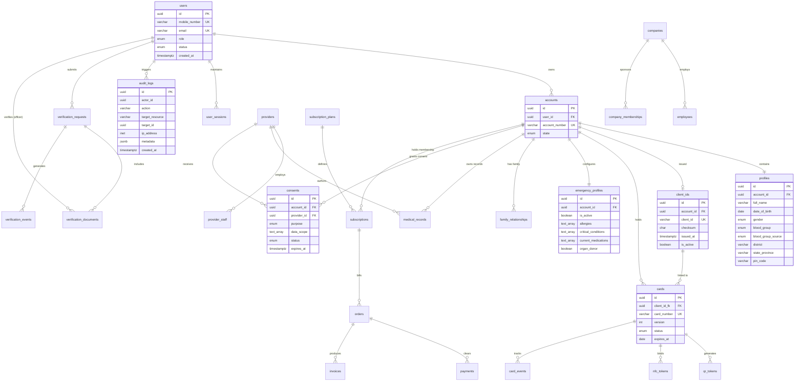

# AHCS — Entity Relationship Diagram (ERD)

```mermaid
erDiagram
    users ||--o{ accounts : "owns"
    users ||--o{ user_sessions : "maintains"
    users ||--o{ audit_logs : "triggers"
    users ||--o{ verification_requests : "submits"
    users ||--o{ verification_documents : "verifies (officer)"
    
    accounts ||--|| profiles : "contains"
    accounts ||--o| client_ids : "issued"
    accounts ||--o{ cards : "holds"
    accounts ||--|| emergency_profiles : "configures"
    accounts ||--o{ family_relationships : "has family"
    accounts ||--o{ medical_records : "owns records"
    accounts ||--o{ consents : "grants consent"
    accounts ||--o{ subscriptions : "holds membership"
    
    verification_requests ||--o{ verification_documents : "includes"
    verification_requests ||--o{ verification_events : "generates"
    
    client_ids ||--o{ cards : "linked to"
    cards ||--o{ qr_tokens : "generates"
    cards ||--o{ nfc_tokens : "binds"
    cards ||--o{ card_events : "tracks"
    
    providers ||--o{ provider_staff : "employs"
    providers ||--o{ medical_records : "authors"
    providers ||--o{ consents : "receives"
    
    subscription_plans ||--o{ subscriptions : "defines"
    subscriptions ||--o{ orders : "bills"
    orders ||--o{ payments : "clears"
    orders ||--o{ invoices : "produces"
    
    companies ||--o{ employees : "employs"
    companies ||--o{ company_memberships : "sponsors"

    users {
        uuid id PK
        varchar mobile_number UK
        varchar email UK
        enum role
        enum status
        timestamptz created_at
    }

    accounts {
        uuid id PK
        uuid user_id FK
        varchar account_number UK
        enum state
    }

    profiles {
        uuid id PK
        uuid account_id FK
        varchar full_name
        date date_of_birth
        enum gender
        enum blood_group
        enum blood_group_source
        varchar district
        varchar state_province
        varchar pin_code
    }

    client_ids {
        uuid id PK
        uuid account_id FK
        varchar client_id UK
        char checksum
        timestamptz issued_at
        boolean is_active
    }

    cards {
        uuid id PK
        uuid client_id_fk FK
        varchar card_number UK
        int version
        enum status
        date expires_at
    }

    emergency_profiles {
        uuid id PK
        uuid account_id FK
        boolean is_active
        text_array allergies
        text_array critical_conditions
        text_array current_medications
        boolean organ_donor
    }

    consents {
        uuid id PK
        uuid account_id FK
        uuid provider_id FK
        enum purpose
        text_array data_scope
        enum status
        timestamptz expires_at
    }

    audit_logs {
        uuid id PK
        uuid actor_id
        varchar action
        varchar target_resource
        uuid target_id
        inet ip_address
        jsonb metadata
        timestamptz created_at
    }
```
